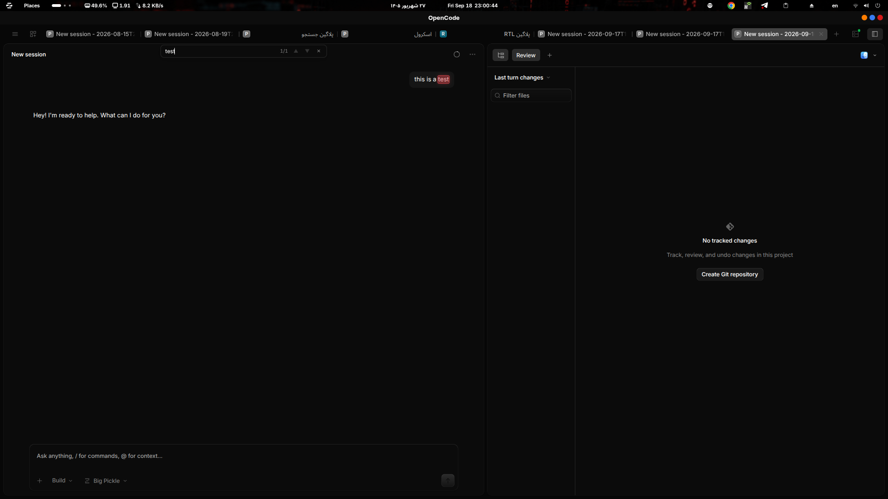

# 🔍 سیرچ‌باکس برای OpenCode دسکتاپ

**پرامپت‌های خودت را داخل چتِ OpenCode دسکتاپ فوری پیدا کن — با شمارندهٔ زنده، پرش بین نتیجه‌ها و اسکرول نرم.**

> نسخهٔ انگلیسی: [README.md](README.md)



---

## این ابزار چیست؟

در OpenCode دسکتاپ، پاسخ‌های مدل دو طرف دیالوگ نمایش داده می‌شوند؛ پس پیدا کردنِ *پرامپت خودت* در یک گفتگوی طولانی کند و گیج‌کننده است. **SearchBox** یک جعبهٔ کوچکِ «جستجو در پرامپت‌های من» به بالای هر چتِ بارگذاری‌شده اضافه می‌کند:

- با تایپ هر عبارت، فقط **پیام‌های خودت (user)** در **همان چت جاری** جستجو می‌شوند.
- **شمارندهٔ زندهٔ نتایج** در هر ضربهٔ کلید به‌روز می‌شود (`n matches`).
- نتایج **هایلایت می‌شوند** (از پایین‌ترین و نزدیک‌ترین‌ها) و روی پنجرهٔ دید نمایش داده می‌شوند.
- بین نتیجه‌ها با دکمه‌های **▲/▼**، کلیدهای **Enter / Shift+Enter** یا **فلش‌های بالا/پایین** حرکت کن.
- دکمهٔ **✕** کل کوئری، هایلایت‌ها و پنل را یک‌جا پاک می‌کند.
- جستجو **مخصوص هر چت** است؛ با عوض کردن چت یا تب، کوئری خودکار پاک می‌شود.
- باکس فقط وقتی ظاهر می‌شود که چت **بارگذاری شده و پیام دارد** — هیچ‌وقت روی چتِ خالی یا نوار تب شناور نمی‌شود.
- **آمادهٔ RTL** است: برای رابط فارسی/عربی همین‌طور خودکار آینه می‌شود.
- اسکرول با **موتور اسکرول خودِ اپ** انجام می‌شود، پس نرم است — هیچ‌وقت با لیست مجازی درگیر نمی‌شود.

این یک **پچ غیررسمی و جراحی‌گونه** روی OpenCode دسکتاپ است. همه‌چیز برگشت‌پذیر است و فایل اصلی همیشه پشتیبان‌گیری می‌شود.

---

## امکانات در یک نگاه

| قابلیت | توضیح |
|---|---|
| جستجو فقط در پرامپت‌های شما | پاسخ‌های مدل هرگز جستجو نمی‌شوند؛ نتیجه‌ها همیشه حرف‌های خودِ شماست |
| شمارندهٔ زنده | `n matches` با هر ضربهٔ کلید به‌روز می‌شود |
| هایلایت و قدم‌زدن | نتیجهٔ فعلی هنگام رسیدن فلش‌هایلایت می‌شود؛ ▲/▼ و Enter / Shift+Enter جابجایی می‌دهند |
| باکس چسبان و غیرشناور | داخل ناحیهٔ چت جاسازی می‌شود — هرگز روی تب‌ها نمی‌افتد |
| نمایش/مخفی‌کردن خودکار | فقط وقتی چتِ دارای پیام بارگذاری شود ظاهر می‌شود |
| دکمهٔ پاک‌کردن | ✕ کوئری و هایلایت‌ها را یک‌جا پاک می‌کند |
| حالت مخصوص هر چت | تغییر چت/تب، کوئری را پاک می‌کند |
| پشتیبانی RTL | رابط برای فارسی/عربی آینه می‌شود |
| اسکرول نرم | از لودر پیام و پنبداپ خودِ اپ استفاده می‌کند (`loadMore → scrollToMessage → seek`) |
| یکتا و برگشت‌پذیر | تزریق با مارکر محافظت می‌شود؛ بکاپ اصلی نگه داشته می‌شود؛ با یک دستور برمی‌گردد |

---

## پچ دقیقاً چه چیزهایی را تغییر می‌دهد؟ (گام‌به‌گام)

`patch-asar.mjs` فایل `app.asar` دسکتاپ OpenCode را از روی بکاپ اصلی بازسازی می‌کند. **دو** تغییر جراحی انجام می‌دهد — و هیچ‌چیز دیگر.

### ۱) `out/renderer/index.html` — رابط جستجو

کلِ SearchBox (استایل‌ها، مارک‌آپ، منطق) *قبل از* تگ ورودیِ `<script type="module">` اپ تزریق می‌شود.

داخل یک چتِ بارگذاری‌شده:

1. باکس (ورودی، شمارندهٔ زنده، دکمه‌های ▲/▼ و ✕) را می‌سازد و به بالای ناحیهٔ پیام می‌چسباند؛
2. خودش را مخفی نگه می‌دارد تا وقتی چتی با پیام بارگذاری شود (`sessionId()` موجود و ردیف‌های `[data-message-id]` وجود داشته باشند)؛
3. در هر ضربهٔ کلید، پیام‌های سشن جاری را می‌گردد، فقط `role === "user"` را نگه می‌دارد و فهرست نتیجه‌ها با **شمارش تعداد تطبیق** می‌سازد؛
4. هایلایت‌های **پایین‌به‌بالا** را روی پنجرهٔ دید رندر می‌کند؛
5. ناوبری را اجرا می‌کند: ▲/▼، Enter (بعدی) / Shift+Enter (قبلی)، ✕ (پاک)؛
6. با تغییر چت/سشن همهٔ state را پاک می‌کند؛
7. اگر زبان رابط RTL باشد، تغییر حالت RTL می‌دهد.

تزریق با مارکرِ `opencode-find-chat-patch` محافظت می‌شود؛ اجرای دوباره هرگز تزریق دولایه نمی‌سازد.

### ۲) `out/renderer/assets/main-<hash>.js` — پل ناوبری (بیلد 11831)

در بیلد 11831 پل (`window.__ocNav`) دقیقاً بعد از افکتِ *پیام‌درانتظار* اپ (`consumePendingMessage: layout.pendingMessage.consume`)، یعنی بالای **اسکوپِ provider** — جایی که توابع خودِ اپ در دسترس‌اند — اضافه می‌شود.

### ۲ب) `out/renderer/assets/route-<hash>.js` — پل ناوبری (بیلد 2.x)

در بیلد **2.0.11** همان زنجیره (`pendingMessage → loadMore → scrollToMessage`) داخل یک چانکِ route با نام‌های مینیمایزشده (`{clearMessageHash, scrollToMessage} = Ck({...})`) زندگی می‌کند. چون نام‌ها در هر بیلد عوض می‌شوند، پچ شناسه‌ها را از همان فراخوانی استخراج و بریج را بلافاصله بعدش تزریق می‌کند. همان API⠀`window.__ocNav` و همان «رقص» نیتیو — بدون بازنویسی.

باندل رندرر اپ مینیمایز شده است، پس نمی‌توان آن را مانند کدِ خوانا پچ کرد. به‌جایش، پچ یک **پل** کوچک (`window.__ocNav`) را دقیقاً بعد از افکتِ *پیام‌درانتظار* اپ (`consumePendingMessage: layout.pendingMessage.consume`)، یعنی بالای **اسکوپِ provider** — جایی که توابع خودِ اپ در دسترس‌اند — اضافه می‌کند.

پل، **اتحادِ توابع خودِ اپ** را بیرون می‌گذارد و چیزی را از نو پیاده‌سازی نمی‌کند:

- `setPendingMessage(id)` / `pendingMessage` / `clearPendingMessage` — اسلاتِ «اینجا برو» خودِ اپ (معمولاً توسط لینک‌های اشتراک‌گذاری پر می‌شود)؛
- `sessionID()` — شناسهٔ سشن فعال (از روتِر)؛
- `messagesReady`، `historyMore()`، `historyLoading`، `loadMore(sid)` — لودر تاریخچهٔ تنبل؛
- `currentMessageId()` / `setActiveMessage(id)` — ردیف/سشن فعالِ store؛
- `revealMessage(id)` / `scrollToEnd()` / `anchor` / `scroller` — توابع reveal و اسکرول خودِ اپ؛
- `autoScroll.pause() / resume()` — کنترل قفل‌شدن به پایین.

SearchBox برای رفتن به هر نتیجه از **زنجیرهٔ ناوبری خودِ اپ** استفاده می‌کند:

```
setPendingMessage(id)
  -> افکت hash-scroll اپ: اگر در messageById() نبود و historyMore()
        -> input2.loadMore(sessionID)   // کل تاریخچهٔ قدیمی‌تر را تا رسیدن لود می‌کند
  -> وقتی پیدا شد:  autoScroll.pause()
                     -> scrollToMessage(msg, "auto")
                     -> seek (تلاش‌های requestAnimationFrame)
                     -> scrollToElement()
  -> SearchBox ردیفِ رسیده را فلش‌هایلایت می‌کند
```

به همین دلیل پرش **نرم** است: دقیقاً همان مسیر کدی است که خودِ OpenCode برای پرش به پیامِ لینک‌شده استفاده می‌کند. ما عمداً `scrollTop` مستقیم نمی‌نویسیم، چون با مجازی‌سازی DOM (`shouldAnchorBottom` + reconcile وی‌رتی‌وآ) وارد درگیری می‌شود و لِق‌لِق ایجاد می‌کند.

اگر هدف فقط در **تاریخچهٔ تنبل** باشد، لودر اول صفحه‌های قدیمی‌تر را لود می‌کند. اگر تطبیق مربوط به یک نوبتِ *reasoning-gated* باشد (بلوکِ فکری‌ای که اپ به‌عنوان ردیف رندر نمی‌کند)، SearchBox به‌جای تظاهر به اینکه جایی فرود آمده، چیپِ **«gated»** نشان می‌دهد.

پل با مارکرِ `opencode-ocnav-bridge` محافظت می‌شود.

### ۳) صحت آرشیو

بعد از تغییرها، `patch-asar.mjs`:

- **SHA-256 بلاکی** (بلاک‌های ۴ مگابایتی، به سبک Electron/update) و سایز هر فایل پچ‌شده را دوباره محاسبه می‌کند؛
- هدر asar (آفست فایل‌ها) را بازسازی می‌کند و آرشیوی کاملاً معتبر می‌نویسد؛
- **فایلی که می‌خواند را هرگز لمس نمی‌کند** — به مسیر خروجی جدا می‌نویسد (به اسکریپت‌های نصب مراجعه کنید).

---

## پیش‌نیازها

| مورد | نیازمندی |
|---|---|
| OpenCode Desktop | هر بیلد جاری؛ انکرهای سازگاری روی بیلد **11831** (`main-*.js`) و **2.0.11** (`route-*.js`) تست شده |
| Node.js | **نسخهٔ ۲۲.۱۲.۰ یا بالاتر** (فقط هنگام نصب لازم است، نه در اجرا) |
| سیستمعامل | لینوکس، مک، ویندوز |
| مجوز | sudo (لینوکس/مک) یا Administrator (ویندوز) — فقط برای کپی نهایی فایل |

اگر بیلد OpenCode شما **هیچ‌کدام** از انکرها را نداشته باشد، `patch-asar.mjs` هشدار می‌دهد و رابط جستجو را تکی نصب می‌کند (ایندکس REST + اسکرول legacy)؛ چیزی خراب نمی‌شود. با نسخهٔ اپ/بیلد issue ثبت کنید — انکر یک ثابتِ کوچک است.

---

## نصب

> اول OpenCode دسکتاپ را کاملاً ببندید.

### لینوکس

```bash
git clone git@github.com:programmer-1998/SearchBox_OpenCode.git
cd SearchBox_OpenCode
bash scripts/install.sh
```

مسیر پیش‌فرض: `/opt/OpenCode/resources/app.asar`. مسیر دلخواه:

```bash
OPENCODE_ASAR=/path/to/app.asar bash scripts/install.sh
```

### macOS

```bash
git clone git@github.com:programmer-1998/SearchBox_OpenCode.git
cd SearchBox_OpenCode
bash scripts/install.sh
```

مسیر پیش‌فرض: `/Applications/OpenCode.app/Contents/Resources/app.asar`.

> **نکتهٔ Apple Silicon:** تغییر باندل ممکن است امضای کد را باطل کند. اگر OpenCode بعد از پچ اجرا نشد، امضا را برگردانید:

```bash
codesign --force --deep --sign - /Applications/OpenCode.app
```

یا بازیابی کنید (به بخش *حذف نصب*).

### ویندوز

```powershell
git clone git@github.com:programmer-1998/SearchBox_OpenCode.git
cd SearchBox_OpenCode
powershell -ExecutionPolicy Bypass -File scripts/install.ps1
```

اسکریپت آرشیو را زیر `%LOCALAPPDATA%\Programs\opencode\resources\app.asar` خودکار پیدا می‌کند (چند مسیر رایج دیگر را هم امتحان می‌کند)، فقط برای کپی نهایی یک‌بار خودش را بالا می‌برد (elevate) و بقیهٔ کارها بدون Administrator انجام می‌شود. مسیر دلخواه: `-App C:\path\to\app.asar`.

---

بعد از نصب:

1. OpenCode دسکتاپ را **کاملاً ببندید** (Cmd+Q / Ctrl+Q / خروج از سینی — بستن پنجره کافی نیست).
2. دوباره باز کنید و چتی که پیام دارد را باز کنید.
3. در باکس تایپ کنید — باکس فوکوس‌شده‌ست و دارد شمارش می‌کند.

---

## استفاده

| کار | روش |
|---|---|
| فوکوس جستجو | باکس هنگام ظاهرشدن خودکار فوکوس می‌شود؛ با کلیک دوباره فوکوس کنید |
| جستجو در پرامپت‌های شما | یک عبارت تایپ کنید؛ فقط پیام‌های `user`ِ همان چت جستجو می‌شوند |
| شمارندهٔ نتیجه | کنار ورودی زنده نمایش داده می‌شود (`n matches`) |
| نتیجهٔ بعدی | **Enter** یا دکمهٔ **▼** (یا فلش پایین) |
| نتیجهٔ قبلی | **Shift+Enter** یا دکمهٔ **▲** (یا فلش بالا) |
| خروج از باکس | Esc یا فوکوس به جای دیگر |
| پاک‌کردن همه | دکمهٔ **✕** |
| چت جدید / تغییر چت | باکس خودکار ریست می‌شود (و اگر چت خالی باشد مخفی می‌شود) |

---

## حذف نصب / بازیابی

هر نصب یک بکاپ اصلی به‌نام `app.asar.bak-original` کنار آرشیوِ فعال نگه می‌دارد.

**لینوکس / مک**

```bash
bash scripts/restore.sh
```

**ویندوز**

```powershell
powershell -ExecutionPolicy Bypass -File scripts/restore.ps1
```

دستی هم ممکن است:

```bash
sudo cp -f "$(dirname app.asar)/app.asar.bak-original" app.asar
```

---

## آپدیت OpenCode دسکتاپ

آپدیت اپ، `app.asar` و همچنین بکاپ قدیمی را بی‌اعتبار می‌کند. بعد از هر آپدیت:

1. بکاپ قدیمی (`app.asar.bak-original`) را پاک کنید،
2. اینستالر را دوباره اجرا کنید — از نسخهٔ فعلی بکاپ می‌گیرد و پچ را دوباره اعمال می‌کند.

---

## عیب‌یابی

| مشکل | علت / راه‌حل |
|---|---|
| باکس ظاهر نمی‌شود | طبق طراحی فقط برای چتی نمایش می‌یابد که بارگذاری شده **و پیام دارد**. چتی با محتوا باز کنید (یا تب عوض کنید). |
| برای عبارتی که مطمئنید هست «۰ نتیجه» | فقط پرامپت‌های شما جستجو می‌شوند — عبارت باید داخل یکی از پیام‌های *خود شما* باشد، نه پاسخ مدل. |
| ناوبری چیپِ «gated» نشان می‌دهد | آن تطبیق یک نوبتِ reasoning-gated است که OpenCode به‌صورت ردیف رندر نمی‌کند؛ نزدیک‌ترین ردیف قابل‌رندر استفاده می‌شود. |
| «provider anchor not found» / «route anchor not recognized» هنگام نصب | بیلد OpenCode شما نه انکر 11831 را دارد نه 2.x. رابط جستجو باز هم نصب می‌شود (حالت تکی: ایندکس REST + اسکرول legacy، بدون pen-drop نیتیو). با نسخهٔ اپ/بیلد issue ثبت کنید — انکر یک ثابتِ کوچک است. |
| «already patched (marker found)» | امن است: اجرای دوباره یکتا است و هیچ‌چیز دو بار تزریق نمی‌شود. |
| مک: اپ بعد از پچ اجرا نشد | امضای کد باطل شده → با `codesign --force --deep --sign - /Applications/OpenCode.app` امضا کنید. |
| ویندوز: آنتی‌ویروس کپی را بلاک می‌کند | برای پوشهٔ نصب OpenCode یک استثنا (exclusion) اضافه کنید؛ آرشیو فقط نوشته می‌شود، اجرا نمی‌شود. |
| پچ بعد از آپدیت اپ از بین می‌رود | طبیعی است — اینستالر را دوباره اجرا کنید (اول بکاپ قدیمی را پاک کنید، بخش *آپدیت*). |

---

## ساختار ریپازیتوری

```
SearchBox_OpenCode/
├── patch/
│   ├── index-inject.html     رابط جستجو + استایل RTL + تمام منطق جستجو (مارکر: opencode-find-chat-patch)
│   ├── bridge.js             پل ناوبری window.__ocNav (مارکر: opencode-ocnav-bridge)
│   └── patch-asar.mjs        ابزار بازسازی asar بدون وابستگی (نیازی به npm install نیست)
├── scripts/
│   ├── install.sh            اینستالر لینوکس + مک (بکاپ خودکار، کپی با sudo)
│   ├── install.ps1           اینستالر ویندوز (تشخیص خودکار، خودبالابر)
│   ├── restore.sh            بازیابی لینوکس + مک
│   └── restore.ps1           بازیابی ویندوز
├── screenshot.png
├── README.md                 این فایل
├── README.fa.md              مستندات فارسی
├── CHANGELOG.md
└── LICENSE                   MIT
```

`patch-asar.mjs` **هیچ وابستگی runtime ندارد** — هدر asar به‌صورت inline پارس و بازنویسی می‌شود؛ پس چیزی برای `npm install` نیست. Node.js نسخهٔ ۲۲.۱۲.۰ یا بالاتر تنها نیاز است.

---

## سازگاری و ایمنی

- **تست‌شده روی:** بیلد **11831** (بریجِ `main-*.js`) و **2.0.11** (بریجِ `route-*.js`) دسکتاپ OpenCode، لینوکس (الکترون). اینستالرهای مک/ویندوز همان اسکیم و مسیرهای خاص هر سیستم را دارند ولی هنوز توسط نویسنده روی سخت‌افزار تست نشده‌اند.
- پچ **مارکرگارد و یکتا** است — اجرای دوباره امن است و آرشیوی یکسان می‌سازد.
- `app.asar` اصلی **همیشه قبل از اولین پچ بکاپ** می‌شود.
- این یک **پچ غیررسمی** است: با ریسک خودتان پچ می‌کنید، بکاپ نگه دارید و مشکلات را صادقانه گزارش دهید — این یک ابزار مصرفی است، نه وابسته به OpenCode.

---

## اعتبارات

ساخته‌شده توسط **سینا خانزاده**

- دیسکورد / تلگرام / اینستاگرام: **programmer_1998**
- وب‌سایت: https://sina-khanzadeh.ir
- ایمیل: **khanzadeh.1377@gmail.com**
- گیت‌هاب: https://github.com/programmer-1998

بخش بزرگی از کار عمداً «چیزی را از نو پیاده‌سازی نکردن» است: SearchBox سوار بر لودر تاریخچه و خط لولهٔ reveal پیامِ خودِ OpenCode است؛ همین دلیل نرم‌بودن تجربه است.

---

## لایسنس

[MIT](LICENSE) © 2026 سینا خانزاده